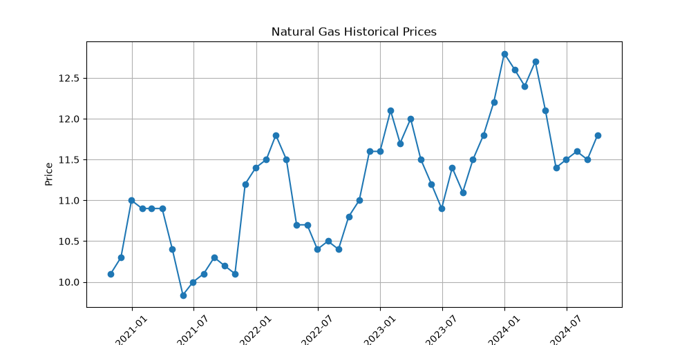
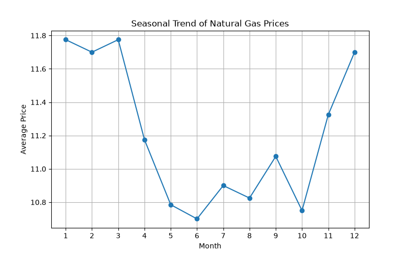

# J.P. Morgan Data Analytics Virtual Experience

## 📌 Project Overview
This repository contains my solutions for the **J.P. Morgan Data Analytics Virtual Experience Program**. The project demonstrates practical applications of **data analytics, financial modeling, time-series forecasting, and credit risk analysis** using Python.

---

## 🚀 Tasks Completed

### 📈 Task 1: Natural Gas Price Forecasting
- Analyzed historical natural gas price data.
- Forecasted future natural gas prices.
- Visualized historical and forecasted trends using Matplotlib.

### 💰 Task 2: Storage Contract Pricing
- Developed a pricing model for natural gas storage contracts.
- Calculated contract profitability considering:
  - Injection costs
  - Withdrawal costs
  - Storage costs
  - Transportation costs

### 📊 Task 3: Credit Risk Model
- Estimated the probability of customer default.
- Performed credit risk analysis using financial data.
- Evaluated borrower risk for lending decisions.

### 🏦 Task 4: FICO Score Quantization
- Categorized FICO credit scores into risk buckets.
- Improved credit score interpretation for credit assessment.

---

## 🛠️ Technologies Used

- Python
- Pandas
- NumPy
- Matplotlib
- VS Code
- Git
- GitHub

---

## 📁 Repository Contents

- `gas_price_forecast.py`
- `task2_storage_pricing.py`
- `task3_credit_risk_model.py`
- `task4_fico_quantization.py`
- `Nat_Gas.csv`
- Project visualizations
- README.md
- requirements.txt
- LICENSE

---

## 📊 Project Visualizations

### Historical Natural Gas Prices

### Natural Gas Price Forecast

### Seasonal Natural Gas Trend

---

## 🎯 Key Skills Demonstrated

- Data Analysis
- Time-Series Forecasting
- Financial Modeling
- Credit Risk Analysis
- Data Visualization
- Python Programming
- Problem Solving

---

## 👨‍💻 Author

**Immadi SKNB Mannikanta**

Aspiring Data Analyst
